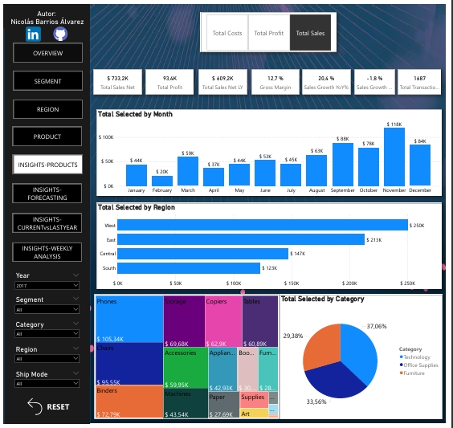

# 📊 Dashboard de Análisis de Ventas y Rentabilidad – Power BI

  

## 📌 Descripción General

Este proyecto desarrolla una solución integral de **Business Intelligence en Power BI** para analizar el desempeño comercial, la rentabilidad y la eficiencia operativa a partir de datos transaccionales de ventas.

Se implementó un modelo dimensional basado en **Star Schema (metodología Kimball)**, garantizando:

✔️ Alto rendimiento en consultas  
✔️ Escalabilidad del modelo  
✔️ Claridad analítica  
✔️ Confiabilidad en los KPIs  

---

## 🎯 Valor para el Negocio

Este dashboard permite:

- 📈 Identificar productos, regiones y segmentos de mayor y menor desempeño  
- 💰 Analizar tendencias de ingresos, utilidad y margen  
- 🚚 Evaluar eficiencia logística  
- 📊 Monitorear crecimiento interanual  
- 🧭 Apoyar procesos de planeación estratégica y forecasting  

---

## 📂 Dataset

- **📍 Fuente:** Dataset público de ventas de una multinacional tecnológica  
- **📍 Granularidad:** Línea de orden de venta  

### Variables principales

- Sales, Profit, Quantity, Discount  
- Order Date, Ship Date  
- Customer, Product, Geography, Ship Mode  

---

## 🧹 Limpieza y Preparación de Datos (ETL)

El proceso ETL se realizó en **Power Query** e incluyó:

✔️ Corrección de formatos numéricos y monetarios por configuración regional

✔️ Limpieza y estandarización de campos de texto para evitar inconsistencias

✔️ Depuración de datos geográficos (ciudad–estado) para asegurar unicidad

✔️ Identificación y eliminación de registros duplicados

✔️ Generación de surrogate keys para garantizar integridad dimensional

✔️ Integración de dimensiones con FactSales mediante merges validados

---

## 🧩 Arquitectura del Modelo de Datos

Se implementó un esquema en estrella con la siguiente estructura:

### 📍 Tabla de Hechos

**FactSales**

- Sales, Profit, Quantity, Discount  
- Order Date, Ship Date  
- CustomerKey, ProductKey, GeographyKey, ShipModeKey  

### 📍 Tablas Dimensión

- **DimCustomer:** Cliente y Segmento  
- **DimProduct:** Producto, Categoría y Subcategoría  
- **DimGeography:** País, Estado, Ciudad, Región  
- **DimShipMode:** Tipo de Envío  
- **DimDate:** Construcción dinámica mediante DAX (CALENDAR) basada en rango real de datos  

---

### ⚙️ Decisiones de Modelado

- Integración de Categoría y Subcategoría en DimProduct (evitando Snowflake)  
- Implementación de surrogate keys en todas las dimensiones  
- Definición de granularidad a nivel de línea de venta  
- Relaciones 1:* con filtrado unidireccional  

---

## 📈 Diseño del Dashboard y Navegación

La navegación se gestiona mediante:

  🔖 Bookmarks  
  🔘 Botones interactivos  
  🔄 Reset de filtros  

### 📊 Secciones Principales

- Overview  
- Segmentación  
- Análisis Regional  
- Análisis de Producto  
- Product Insights  
- Forecasting  
- Actual vs Año Anterior  
- Análisis Semanal  

---

## 🧠 Retos Técnicos y Soluciones

🔹 Formato incorrecto de datos monetarios → Ajuste de configuración regional

🔹 Ausencia de claves geográficas → Diseño e implementación de surrogate keys

🔹 Definición de jerarquías y granularidad → Integración en dimensiones

🔹 Cálculo correcto de porcentajes dinámicos → Gestión avanzada del filter context con ALLSELECTED

🔹 Navegación compleja → Implementación de bookmarks y control de estados 

---

## 🚀 Habilidades Demostradas

✔️ Modelado dimensional bajo esquema estrella (Star Schema)
✔️ Procesos ETL completos en Power Query
✔️ Limpieza y estandarización avanzada de datos
✔️ Desarrollo de métricas y KPIs en DAX (Time Intelligence, YoY, acumulados, variaciones)
✔️ Gestión avanzada de contextos de filtro en DAX
✔️ Análisis temporal mediante tablas calendario
✔️ Diseño de dashboards ejecutivos orientados a toma de decisiones
✔️ Optimización de rendimiento mediante reducción de cardinalidad y buenas prácticas de modelado

---

> 🎯 **Nota:** Este proyecto fue desarrollado con enfoque en escenarios empresariales reales y mejores prácticas de Business Intelligence.
